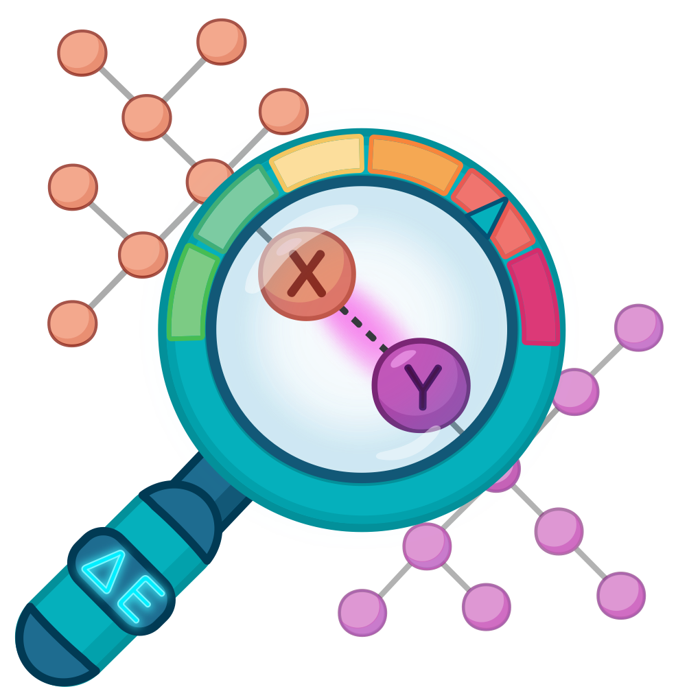

# NCITools — Non-Covalent Interaction Analysis

<p align="center">
  
</p>

[](LICENSE)
[](https://www.python.org/)

**NCITools** is a Python package for the automatic detection of **non-covalent interactions (NCIs)** from molecular structures. The current release focuses on a **geometry-based** approach: all interactions are inferred from atomic coordinates and covalent connectivity alone, without any quantum-chemical input.

A future release will add a complementary **topology-based** approach using QTAIM bond critical points from electron-density cube files.

---

## What are non-covalent interactions?

**Non-covalent interactions** are attractive or repulsive forces between molecules or atoms that are **not** connected by shared electron pairs (unlike covalent bonds). They play a key role in stabilizing proteins, DNA, crystal packing, and molecular recognition.

Typical examples:
*   **Hydrogen bonds** (e.g., between water and alcohol)
*   **π–π stacking** (between aromatic rings)
*   **Halogen bonds** (involving Cl, Br, I)
*   **Van der Waals forces**

## Key features (geometry-based)

For every structure NCITools detects:

*   **Hydrogen bonds** (D–H···A)
*   **Halogen bonds** (D–X···A, X = Cl, Br, I)
*   **Chalcogen bonds** (X = S, Se, Te)
*   **Pnictogen bonds** (X = P, As, Sb, Bi)
*   **Tetrel bonds** (X = Si, Ge, Sn, Pb)
*   **π···π stacking** between aromatic rings
*   **X–H···π contacts**
*   **Lone-pair···π (n···π) contacts**
*   **Ion···π contacts**
*   **Metallophilic-like contacts** (Au, Ag, Cu, Hg, Ir, Pt, Pd, Ni)
*   **Carbonyl n→π\* contacts** (Bürgi–Dunitz geometry)

Each contact is scored by a **soft (fuzzy) confidence value** in `[0, 1]`, obtained as the product of smooth geometric criteria (distance, two angles). A contact is reported only if its score exceeds a user-supplied threshold. Default is **0.75**.

### What is the Confidence Score and how to interpret it?

The **Confidence Score** is a number between 0 and 1 that indicates how closely the found geometric pattern resembles an “ideal” interaction of that type.

**Important:** it is **not a probability** in a statistical sense and **not a guarantee** that the interaction exists. It is a measure of the “geometric purity” of the contact.

**Interpretation:**

| Range | Meaning | Recommendation |
| :--- | :--- | :--- |
| **0.90 – 1.00** | Very high confidence. Geometry is almost ideal for this type of interaction. | Can be considered a reliable result. |
| **0.75 – 0.90** | High confidence. Geometry is good but with minor deviations from ideal. | Usually considered reliable. This is the default threshold. |
| **0.50 – 0.75** | Medium confidence. Geometry deviates noticeably from ideal. | Requires visual inspection. May be a different interaction type or an artefact. |
| **0.00 – 0.50** | Low confidence. Geometry is far from ideal for this type. | Likely a random close contact, not a real interaction. |

**Example:** A hydrogen bond with `confidence score = 0.94` (see table below) is a very reliable result. A bond with `score = 0.60` may be a weak or distorted hydrogen bond and should be checked manually.

### How are aromatic rings identified?

Aromatic rings are identified by combining three criteria:

1.  **Cycle detection** on the covalent graph.
2.  **Planarity test** (RMS deviation of ring atoms from the best-fit plane).
3.  **HOMA aromaticity index** above a threshold.

### Energy estimation

Interaction energies are estimated with published empirical correlations (Rozenberg, Espinosa, etc.). The correlations live in `ncitools/correlations.py`.

At present, correlations are available only for some types of non-covalent interactions:

*   **Hydrogen bonds:** OHO, OHN, NHO, CHO, CHN, NHN. Default correlation of Wendler [J. Phys. Chem. A, 2010, 114(35), 9529-9536.] is used for other types of hydrogen bonds.
*   **Halogen bonds** (X = Cl, Br, I): X-N, X-O.
*   **Chalcogen bonds** (Ch = S, Se, Te): Ch-F, Ch-Cl, Ch-Br, Ch-I.
*   **Pnictogen bonds** (Pn = P, Sb): Pn-F, Pn-Cl, Pn-Br, Pn-I.

For other types of non-covalent interactions energy estimation is currently unavailable.

---

## Installation

NCITools requires **Python ≥ 3.9**.

```bash
# Clone the repository
git clone https://github.com/NCI-laboratory-SPb/NCITools.git
# Or download an archive from GitHub and unpack it
cd NCITools

# We recommend creating a new environment for safe isolation
python -m venv venv
source venv/bin/activate    # Linux/macOS
# or .\venv\Scripts\activate  (Windows)

# Install the package in development mode
pip install -e .
```

For development (tests, linting):

```bash
pip install -e ".[dev]"
```

---

## Quick start

### Command line

```bash
ncitools geom my_structure.xyz
```

This writes a human-readable report to `my_structure.nci` and prints a per-family summary to the terminal:

```
Loaded 24 atoms from my_structure.xyz
  covalent bonds: 24
  aromatic rings: 1

Detected interactions:
  Hydrogen bonds         3
  π···π stacking         1
  X–H···π                2

Report written to my_structure.nci
```

Useful options:

```bash
ncitools geom complex.pdb \
    --angle-tol 120 \      # Angle tolerance (degrees)
    --confidence 0.8 \     # Confidence score threshold
    --radii bondi \        # Van der Waals radii set
    -o complex_analysis    # Output file name
```

`ncitools geom --help` lists everything.

### Python API

```python
from ase.io import read
from ncitools.geometry import (
    build_graph_with_covalent_pairs,
    find_nci_bonds,
    find_nci_with_aromatic,
    output,
)

atoms = read("complex.xyz")

# Build the covalent graph
G = build_graph_with_covalent_pairs(atoms)

# Find hydrogen bonds (D-H···A)
G = find_nci_bonds(atoms, G, ["H"], 110.0, "HB")

# Find interactions with aromatic rings
G = find_nci_with_aromatic(atoms, G)

# Write the .nci report
output(G, filename="complex", ext=".xyz")
```

---

## Output format

The `.nci` file is plain text with one table per interaction family. Columns depend on the family. A hydrogen-bond table looks like this:

```
| № | Type     | Confidence score | D | H | A | D-H (Å) | H···A (Å) | D···A (Å) | Angle DHA (°) | Angle RAH (°) | Energy (kcal/mol) |
|---|----------|------------------|---|---|---|---------|-----------|-----------|---------------|---------------|-------------------|
| 1 | O-H···O  | 0.94             | 1 | 2 | 6 | 0.970   | 1.812     | 2.771     | 170.2         | 118.5         |  4.8              |
```

**Legend:**
*   **D, H(X), A** – atomic numbers of the donor (D), hydrogen or halogen (H/X), and acceptor (A).
*   **R** – an atom covalently or coordinatively bonded to the acceptor A.
*   **Confidence score** – measure of geometric “purity” of the contact (see above).
*   **Angle DHA** – angle between donor, hydrogen, and acceptor.
*   **Angle RAH** – angle between atom R, acceptor A, and hydrogen.

Columns for other families can be interpreted in the same fashion.

---

## Package layout

```
ncitools/
├── cli.py                    # click-based command line interface
├── constants.py              # radii, HOMA parameters, element sets
├── utils.py                  # input readers
├── quotes.py                 # signature quotes for the report
├── correlations.py           # empirical geometry → energy correlations
└── geometry/
    ├── soft.py               # smooth (fuzzy) threshold functions
    ├── geom.py               # HOMA, best-fit planes, planarity metrics
    ├── graph_builder.py      # molecular graph from coordinates
    ├── output.py             # formatted .nci report writer
    └── detectors/
        ├── _common.py        # shared acceptor-angle rules
        ├── sigma_hole.py     # HB, XB, ChB, PnB, TetB
        ├── aromatic.py       # π···π, H···π, n···π, ion···π
        ├── carbonyl.py       # n→π* with carbonyls
        └── metallophilic.py  # metal···metal contacts
```

---

## Roadmap

Not yet in this release — planned for the next ones:

- **Topology-based analysis** (QTAIM) from electron-density cube files.
- **Quantum-chemical helpers**: DFT cube generation with PySCF.
- **Structure preparation**: PDB fixing, hydrogen addition, xTB calculator.
- **Format conversion** utilities.

The code paths for these modules exist in the repository but are not shipped in the first release.

---

## Disclaimer

The detector reports geometric patterns, not **chemical truths**. A short N···O contact may be a chalcogen bond, a pnictogen bond, or an artefact — **manual verification of borderline cases is expected**.

---

## Limitations

- **Hydrogen atoms must be explicit** in the input structure for hydrogen-bond detection.
- **Deuterium (`D`) is not recognised**; rename it to `H` before use.
- All coordinates are assumed to be in **Ångströms (Å)**.
- Input reading stability is extensively tested on **xyz**-files. Other types like gaussian log/out, mol/mol2 and cif are also available through `ase.io.read`. Protein databank files are available through `ase.io.proteindatabank.read_proteindatabank`.

---

## Contributing

Bug reports, feature requests and pull requests are welcome. Please open an issue before submitting a large change.

---

## License

Distributed under the MIT License — see [LICENSE](LICENSE).

---

## Citation

If you use NCITools in scientific work, please cite the original 
methodological papers; each empirical correlation is documented in the docstring 
of `ncitools/correlations.py`. A Zenodo URL: https://doi.org/10.5281/zenodo.23194421.